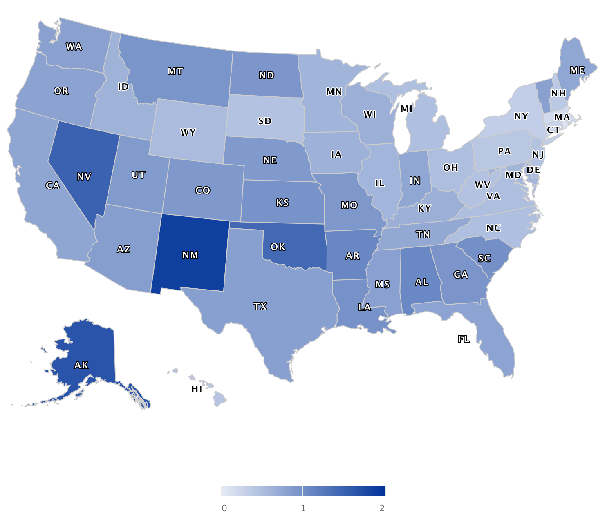

```{r setup, echo = FALSE, message = FALSE}
library(tidyverse)
library(readr)
library(readxl)
library(kableExtra)
library(knitr)
library(modelr)
library(patchwork)

knitr::opts_chunk$set(
  echo = FALSE, 
  fig.width = 10,
  fig.height = 5,
  out.width = "90%",
  message = FALSE,
  warning = FALSE
)

theme_set(theme_minimal() + theme(legend.position = "bottom"))

options(
  ggplot2.continuous.colour = "viridis",
  ggplot2.continuous.fill = "viridis"
)

options(knitr.table.format = "html")
scale_colour_discrete = scale_colour_viridis_d
scale_fill_discrete = scale_fill_viridis_d
```

```{r, echo=FALSE}
main_df <- 
  read_csv("./data/maindata.csv")

main_df <- 
  main_df %>% 
  mutate(year = lubridate::year(date_of_death)) %>% 
  filter(year != 2021)
```

```{r, echo=FALSE}
pop_stat <- 
  read_csv("data/census.csv")
```

```{r, echo=FALSE}
gun_owner <- 
  read_csv("data/Gun Ownership by State 2021.csv") %>% 
  janitor::clean_names() %>% 
  select(-total_guns)
```

```{r, echo=FALSE}
crime_stat <- 
  read_excel("data/reported-violent-crime-rate-in-the-us-2020-by-state.xlsx", 
             sheet = "Data",
             range = "B5:C57") %>%
  rename(state = 1, crime_per_10e6 = 2) %>% 
  filter(state != "United States") %>% 
  mutate(crime_per_10e6 = as.numeric(crime_per_10e6))
```

```{r, echo=FALSE}
unempolyment_stat <- 
  read_excel("data/state-unemployment-rate-in-the-us-2020.xlsx", 
             sheet = "Data",
             range = "B5:C56") %>% 
  rename(state = 1, unemploy_rate = 2) %>% 
  mutate(unemploy_rate = as.numeric(unemploy_rate)/100)
```

```{r, echo=FALSE}
main_df <- 
  read_csv("./data/maindata.csv")

main_df <- 
  main_df %>% 
  mutate(year = lubridate::year(date_of_death)) %>% 
  filter(year != 2021)
```

```{r, echo=FALSE}
pop_stat <- 
  read_csv("data/census.csv")
```

```{r, echo=FALSE}
gun_owner <- 
  read_csv("data/Gun Ownership by State 2021.csv") %>% 
  janitor::clean_names() %>% 
  select(-total_guns)
```

```{r, echo=FALSE}
crime_stat <- 
  read_excel("data/reported-violent-crime-rate-in-the-us-2020-by-state.xlsx", 
             sheet = "Data",
             range = "B5:C57") %>%
  rename(state = 1, crime_per_10e6 = 2) %>% 
  filter(state != "United States") %>% 
  mutate(crime_per_10e6 = as.numeric(crime_per_10e6))
```

```{r, echo=FALSE}
unempolyment_stat <- 
  read_excel("data/state-unemployment-rate-in-the-us-2020.xlsx", 
             sheet = "Data",
             range = "B5:C56") %>% 
  rename(state = 1, unemploy_rate = 2) %>% 
  mutate(unemploy_rate = as.numeric(unemploy_rate)/100)
```

```{r, echo=FALSE}
reg_df1 <- 
  main_df %>% 
  group_by(year, state, age_bin, gender, race) %>% 
  summarize(count = n()) %>% 
  filter(year %in% c(2010:2020), state != "DC") %>% 
  left_join(pop_stat, by = c("year", "state", "age_bin", "gender", "race")) %>% 
  mutate(innocent_kill_per100k = count / population * 10^5)
```

```{r include=FALSE,echo=FALSE}
# Join data
pop_gun_crime_unemply <- 
  gun_owner %>% 
  left_join(crime_stat, by = "state") %>% 
  left_join(unempolyment_stat, by = "state") %>% 
  mutate(state = state.abb[match(state, state.name)]) %>% 
  select(state, everything())

reg_df2 <- 
  reg_df1 %>% 
  filter(year == 2020) %>% 
  left_join(pop_gun_crime_unemply, by = "state") %>% 
  select(2:5, 8:11)
```

## Motivation
In the wake of George Floyd’s murder, several protests arose across the nation. This motivates us to investigate innocent deaths under police violence and the association of confounders with the excessive police force. Although the majority of encounters that meet death with law enforcement officials present a lethal threat to officers or society, there are still people involved in the police action that meets death with a quantity not to be ignored.  This project analyses the data on people involved in a police operation and results in fatalities.  Despite the assessment of the overuse of police force across geographical factors, this project also focuses on socioeconomic factors, political factors, and others.

## Initial Questions
- What is the trend of innocent killing by police overtime in the U.S. 
- Which state has higher rates of gun ownership, crime rates, and unemployment rates than others.
- Whether the factors above have potential correlations with the number of innocent killings in the U.S.

## Data
The main dataset for our project is from Kaggle and to make a more comprehensive analysis, we also combined other datasets from sources like the World Population Review, Statista, and the U.S. Bureau of Labor Statistics, etc. To make this report have both realistic social significance and far-reaching historical significance, we only analyze the cases between 2010 and 2020, even though the main dataset contains a wider time frame.  

### The following is a brief description of the main data cleaning:  
- Use reasonable variables and select key variables for further analysis;
- Drop NA values in some columns;
- The gender with `Transgender`, race with `Middle Eastern` and `Race Unspecified`, and age under one are not considered in this analysis;
- Do the following mutations:
  - Replace NA values in the `age` with the mean in each group
  - Remove the comma in a value of `latitude value`
  - Normalize several similar terms in `highest_force`
  - Convert the data type of some variables and create a new variable `age_bin`
- Rearrange data

## Exploratory Data Analysis
### Innocent Death Rate per 10k population 
The following image shows the innocent death rate per 100k population from 2010 to 2020 in each state of the U.S.


### US Total
The total amount of innocent death across 50 states by year in the U.S. from 2010 to 2020 is shown as follows. This graph illustrates that the number of cases has increased year by year and stabilized after 2013. It is reassuring that there may be a downward trend in this total count after 2017.
```{r}
main_df %>% 
  filter(year %in% c(2010:2020)) %>% 
  group_by(year) %>% 
  summarize(count = n()) %>% 
  ggplot(aes(x = year, y = count, fill = year)) + 
  geom_bar(stat = "identity") +
  geom_text(aes(label = count), vjust = -.8) + 
  scale_x_continuous(breaks = c(2010:2020)) +
  theme(legend.position = "none") + 
  labs(
    x = "Year", 
    y = "Total Number",
    title = "Overall Innocent Death Cases in the U.S.")
```

### Sex
The graph below shows a huge difference in the total amount of innocent killings between men and women. These unfortunate cases generally occur in the male group, although the proportion of male and female remains roughly the same from 2010 to 2020.
```{r}
main_df %>% 
  filter(year %in% c(2010:2020)) %>% 
  group_by(year, gender) %>% 
  summarize(count = n()) %>% 
  ggplot(aes(x = year, y = count, fill = gender)) + 
  geom_bar(stat = "identity", position = position_dodge()) +
  scale_x_continuous(breaks = c(2010:2020)) +
  theme(legend.title = element_blank()) + 
  labs(
    x = "Year",
    y = "Total Number",
    title = "Number of Innocent Death by Gender")
```

### Age
The 55-84 age group accounts for the largest proportion among all age groups.
```{r}
main_df %>% 
  filter(year %in% c(2010:2020)) %>% 
  group_by(year, age_bin) %>% 
  summarize(count = n()) %>% 
  ggplot(aes(x = year, y = count, fill = age_bin)) + 
  geom_bar(stat = "identity") +
  scale_x_continuous(breaks = c(2010:2020)) +
  theme(legend.title = element_blank()) + 
  labs(
    x = "Year",
    y = "Total Number",
    title = "Number of Innocent Death by Age")
```

### Race and ethicity
Although the total number of innocent death changes every year, the European-American/White race group will consistently account for the largest proportion and comes the African-American/Black group.
```{r}
main_df %>%
  filter(year %in% c(2010:2020)) %>% 
  group_by(year, race) %>% 
  summarize(count = n()) %>% 
  ggplot(aes(x = year, y = count, fill = race)) + 
  geom_bar(stat = "identity") +
  scale_x_continuous(breaks = c(2010:2020)) +
  theme(legend.title = element_blank()) + 
  labs(
    x = "Year",
    y = "Total Number",
    title = "Number of Innocent Death by Race")
```

### Gun Ownership, Crime Rate, and Unemployment Rate
The following three graphs show the rate of gun ownership rate, crime, and unemployment in all 50 states in the U.S.
```{r}
gun_plot <-   
  gun_owner %>% 
  mutate(state = fct_reorder(state, gun_ownership)) %>% 
  ggplot(aes(x = gun_ownership, y = state, fill = state)) + 
  geom_bar(stat = "identity", show.legend = FALSE) + 
  labs(x = "Gun Ownership Rate",
       y = "State")
```

```{r}
crime_plot <- 
  crime_stat %>% 
  filter(state != "District of Columbia") %>% 
  mutate(state = fct_reorder(state, crime_per_10e6)) %>% 
  ggplot(aes(x = crime_per_10e6, y = state, fill = state)) + 
  geom_bar(stat = "identity", show.legend = FALSE) + 
  labs(x = "Crimte rate per 100k",
       y = element_blank())
```

```{r}
unemploy_plot <- 
  unempolyment_stat %>% 
  filter(state != "District of Columbia") %>% 
  mutate(state = fct_reorder(state, unemploy_rate)) %>% 
  ggplot(aes(x = unemploy_rate, y = state, fill = state)) + 
  geom_bar(stat = "identity", show.legend = FALSE) + 
  labs(x = "Unemployment rate",
       y = element_blank())
```

```{r, fig.width = 12}
gun_plot + crime_plot + unemploy_plot
```


## Statistical Analysis
For statistical analysis, we come up with two regression models. The first one contains variables including state, age, gender, and race based on the data from year 2010 to 2020, while the second one considers not only the above predictors but also the other three: gun ownership, crime rate, and unemployment rate in 2020. Since we believe that all these three factors may somehow connect with the rate of innocent killings by the police in the U.S. For instance, the police might be armed with more advanced weapons in the states where the crime rate is high, which will lead to a higher rate of innocent killings in these regions.  
The following graph is the distribution of the target variable `innocent_kill_per100k`, we can see that the distribution has nothing to do with the normal, therefore we need to perform a transformation.
```{r}
before_trans = reg_df1 %>% 
  ggplot(aes(x = innocent_kill_per100k)) + 
  geom_density(color = "dodgerblue1", fill = "skyblue2") + 
  geom_vline(xintercept = mean(reg_df1$innocent_kill_per100k), linetype = "dotted") +
  labs(x = "innocent death(per 10K)")

After_trans = reg_df1 %>% 
  ggplot(aes(x = log(innocent_kill_per100k))) + 
  geom_density(color = "dodgerblue1", fill = "skyblue2") + 
  geom_vline(xintercept = mean(log(reg_df1$innocent_kill_per100k)), linetype = "dotted") + 
  labs(x = "log(innocent death per 10K)")

before_trans + After_trans
```

After transforming the variable `innocent_kill_per100k`, we could look at the plot in the left where the distribution is much more normal than before which satisfy the 
assumption of normality.

## Results
By transformation above, the formula is below:

$$ log(innocent \space death \space per \space 100k) = \beta_0 + \beta_1year + \beta_2state + \beta_3 age + \beta_4 gender + \beta_5 race$$
Based on the summary and statistics which you could see in the part of regression-model 1, we could conclude that all all predictor are significant in statistical aspect although some levels in state have no significant association.

```{r echo=FALSE}
fit1 <- lm(log(innocent_kill_per100k) ~ year + state + age_bin + gender + race, data = reg_df1)

summary(fit1) %>% 
  broom::glance() %>% 
  knitr::kable() %>% 
  kable_styling()
```

When concentrating on the table of R.squared, we could figure out that $R^2$ value is 0.72 which means that 72% of the variability in the outcome data can be explained by the model, especially if R-squared value r > 0.7 this value is generally considered strong effect size *(Ref:Moore, D. S., Notz, W. I, & Flinger, M. A. (2013). The basic practice of statistics (6th ed.))*

In order to further make sure the accuracy of model 1 and the homoscedasticity of residual, we draw four plots which are Residuals vs Fitted, Normal QQ, Scale-Location and Residuals vs Leverage respectively. When looking at the plots, we could figure out that the homoscedasticity of residual is proved.

```{r echo=FALSE}
# Model diagnosis
par(mfrow = c(2, 2))
plot(fit1)
```

In addition to the model above, we are still eager to dig out another potential predictors for innocent death so that we fitted another model by adding three variables (Gun ownership rate, Crime rate per 100K and unemployment rate) and the model 2 we are going to fit is: 

$$ log(innocent \space death \space per \space 100k) = \beta_0 +  \beta_1state + \beta_2 age + \beta_3 gender + \beta_4 race + \beta_5Gun \space ownership \space rate$$ 
$$ + \beta_6Crime \space rate + \beta_7 Unemployment \space rate$$
```{r}
fit2 <- lm(log(innocent_kill_per100k) ~ state + age_bin + gender + race + gun_ownership + crime_per_10e6 + unemploy_rate, 
    data = reg_df2)

summary(fit2) %>% 
  broom::glance() %>% 
  knitr::kable() %>% 
  kable_styling()
```

When concentrating on the table of R.squared, we could figure out that adjusted $R^2$ value is 0.75 which means that 75% of the variability in the outcome data can be explained by the model, especially if R-squared value r > 0.7 this value is generally considered strong effect size

For model 2, we also draw four plots to prove the homoscedasticity of residual and we could find that the multiple linear regression fits well.


## Conclusion

## Discussion

## Contribution


<font size="5"><a href = "#top" target = "_self">Back to top</a></font>