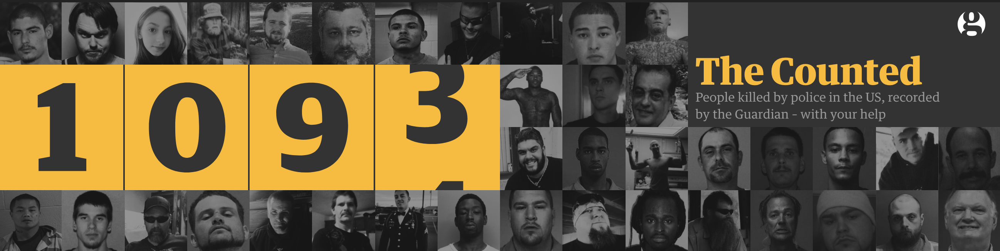

    
```{r setup, echo = FALSE, message = FALSE}
library(tidyverse)

knitr::opts_chunk$set(
  message = FALSE,
  warning = FALSE
)
```

<b>Exploring the innocent killing rate in the U.S. by police from 2000 to 2020</b>

<font size="3">By: Hening Cui | Jialiang Hua | Congyang Xie | Wenhan Bao | Qihang Wu</font>


<font size="2"> Image source: [The Guardian](https://www.theguardian.com/us-news/series/counted-us-police-killings)</font>

<br>

### Background
In the wake of George Floyd’s murder, a number of protests arisen across the nation. This motivates us to investigate innocent deaths under police violence and the association of confounders with excessive police force. Although the majority encounters that meet death with law enforcement officials present a lethal threat to officers or society, there are still people that involved in the police action meets death with a quantity not to be ignored.  This project analyses the data on people involved in a police operation and results in fatalities.  Despite the assessment of  overuse of police force across geographical factors, this project also focuses on socioeconomic factors, political factors and periodical patterns. 


### Datasets

- Main data: [Innocent death by polices](https://www.kaggle.com/kannan1314/innocent-deaths-caused-by-police-all-time)
- Other sources:
  - [Gun ownership by state 2021](https://worldpopulationreview.com/state-rankings/gun-ownership-by-state )
  - [Crime rate by state 2020](https://www.statista.com/topics/2153/crime-in-the-united-states/#dossierKeyfigures)
  - [Unemployment rate by state 2020](https://www.bls.gov/web/laus/laumstrk.htm)


### Findings {.tabset}

#### Findings from Explorative analysis
We have many interesting findings from explorative analysis. We found that the count of innocent death caused by police in the USA rised greatly from 2010 to 2014, and then falled slightly from 2014 to 2020. The peak of the innocent death count among the 10 years was 2014. We also found male occupied a much larger proportion of innocent deaths compared to female. And the ratio of male to female remains roughly the same from 2010 to 2020. As for age groups effect, the ratio between different age groups are consistent over the 10 years, and the age group (25-34) has the largest share of innocent deaths. For the effect of race, the Hispanic race accounts for the largest proportion and the rates from 2010 to 2020 are similar.


#### Findings from regression analysis.

We developed two models to investigate the association between innocent death by police and potential factors. Our first regression model indicates that all our main predictor(year, state, age, gender, race) are statistically significant although some levels in state are not. This indicates that there indeed are group differences by year, age, gender, race and some of the states. Our second regression model investigate more potential predictors of innocent deaths and their association. We found that there are significant association between innocent deaths rate and gun ownership rate, crime rate and unemployment rate. Further detailed analyses and plots are in the Regression Analysis sections.


### Report
Our report can be found from [here](report_link.html)


### Website Navigation


- [Dashboard](dashboard.html)
- [About](about.html)
- [Resource](resource.html)


### Contributors
- Hening Cui
- Jialiang Hua
- Congyang Xie
- Wenhan Bao
- Qihang Wu


<font size="3"><a href = "#top" target = "_self">Back to top</a></font>